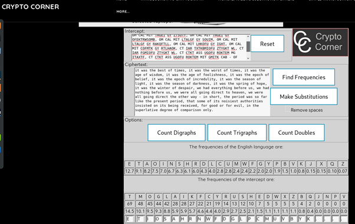

### Answer 1
The given encryption python script was researched and found out to be performing the XOR operation with a fixed symmetric key of 13. Since XOR is a reversible algorithm for encryption and decryption, the same python script was used for decryption as given below -
```
def decrypto (filename):
 f = open(filename,"rb")
 o = open("dec.png", "w")
 blob = f.read()
 i = 0
 key = 13
 for b in blob:
   x = ord(b) ^ (i % key)
   o.write(chr(x))
   i += 1

filename = "q1.png.enc"
decrypto(filename)
```

The decrypted image that resulted was -


It seems to be be a fast yet simple algorithm for symmetric key encryption, as long as the key is kept secret. However with brute forcing the key I think it is easy to see all output resulting decrypting images and possible to see the encrypted message or file.

### Answer 2
Using sample code from workshop, a RSA decryption python script was written and the values of p, q and e were declared in the script along with the encrypted message. The output of the script prints all the outputs of steps for decryption, such as converting hex to int, decrypting using RSA and performing unhexlify to obtain the string. The python script that was used is -

```
import binascii

encHex = "4A070566DB88A19A8C1212E41DCE3AE42112A8388DA3872EE44AF4C8E654A198"
print "encrypted hex is: " + encHex + '\n'
cipher = int(encHex,16)

print "base 16 int version of hex = cipher is: " + str(cipher) + '\n'

def invmod(a,n):
  i=1
  while True:
	c = n * i + 1;
	if(c%a==0):
  	c = c/a
  	break;
	i = i+1
  # note: indent before the following statement
  return c

p = int("C5A047A7C52ED3A2875F7D76C47B555F",16) # first prime
q = int("C93268355C09197BBF1659B5522FFACD",16) # second prime
e = int("010001",16) # a number that is co-prime with (p-1)*(q-1)

# calculate modulus n
# n = 9B51C20306EDE535C8FCAADBC3F3515E52A0D005703DD449BEC66B23E2932313
n = p*q
print "calculated n is: " + str(n) + '\n'

# calculate inverse modular d of exponent e and (p-1)*(q-1)
d = invmod(e, (p-1)*(q-1))
# d = 0D067636BAC6088AD2281E4BFFCACFEFEF9BC1A69FB9E701063DFBAAB436E4C1
print "caclculated d is: " + str(d)

# check that d*e mod (p-1)*(q-1) is indeed 1
print "checking d*e mod (p-1)*(q-1): " + str(((d*e) % ((p-1)*(q-1)))) + '\n'


# decrypt message using private exponent d
plain = pow(cipher, d, n) # supplying the 3rd parameter efficiently computes the mod
msg = binascii.unhexlify("%x" % plain)


print "Cipher " + str(cipher) + " after RSA decryption and unhexlify is decrypted to: " + str(msg) + '\n'
```

Output after running  the script was - 
```
# python rsadecryption.py

encrypted hex is: 4A070566DB88A19A8C1212E41DCE3AE42112A8388DA3872EE44AF4C8E654A198

base 16 int version of hex = cipher is: 33483556006381054149613526142669559072056027658400581727028836768034134991256

calculated n is: 70252945163054194920847511977408156476811805984949774253562479404028773212947

calculated d is: 5891483995546727120328637652438091886928667918827959299068453294388039574721
checking d*e mod (p-1)*(q-1): 1

Cipher 33483556006381054149613526142669559072056027658400581727028836768034134991256 after RSA decryption and unhexlify is decrypted to: Cowwanbanga!
```
So the unencrypted message is Cowwanbanga!

### Answer 3
After I opened the original encrypted image file in hexeditor, I noticed there is a salt in the header so the file must be encrypted with CBC. I tried to decrypt it using openssl with ECB and CBC modes of AES encryption. 

After the hints on discussion forucms I tried to see what happens if I replace the header with an unencrypted header from a different image given in the workshop. It opened the image and also confirmed that only the header is encrypted with CBC. After another hint I replaced the header with header of a random 16-bit color bitmap image of the 1024x768 screen resolution hint given in the file name. This revealed the message when I opened the picture -


It seems the hidden message is one word CYBER.


### Answer 4
The following website was used to do the frequency analysis on the letters and substitute them to decipher the original plaintext -
https://crypto.interactive-maths.com/frequency-analysis-breaking-the-code.html

Here is a screenshot of the website - 


After trying out and guessing some words I put that in the Google Search Engine and got the original passage from Chapter I of the Book - A Tale of Two Cities 
https://en.wikiquote.org/wiki/A_Tale_of_Two_Cities
As seen in the screenshot, the original plaintext must be something like this  -
it was the best of times, it was the worst of times, it was the age of wisdom, it was the age of foolishness, it was the epoch of belief, it was the epoch of incredulity, it was the season of light, it was the season of darkness, it was the spring of hope, it was the winter of despair, we had everything before us, we had nothing before us, we were all going direct to heaven, we were all going direct the other way - in short, the period was so far like the present period, that some of its noisiest authorities insisted on its being received, for good or for evil, in the superlative degree of comparison only.

I couldn't find any pattern used for encryption so the key must be something like this -


### Answer 5
Running the following hashcat command revealed the password for superman through brute force -
```
# hashcat -m 500 -a 0 -o output hash.hash /usr/share/wordlists/rockyou.txt -O --force
```

The output of the command was -
```
hashcat (v5.1.0) starting...

OpenCL Platform #1: The pocl project
====================================
* Device #1: pthread-AMD Ryzen 7 2700U with Radeon Vega Mobile Gfx, 2048/5930 MB allocatable, 4MCU

Hashes: 1 digests; 1 unique digests, 1 unique salts
Bitmaps: 16 bits, 65536 entries, 0x0000ffff mask, 262144 bytes, 5/13 rotates
Rules: 1

Applicable optimizers:
* Optimized-Kernel
* Zero-Byte
* Single-Hash
* Single-Salt

Minimum password length supported by kernel: 0
Maximum password length supported by kernel: 15

Watchdog: Hardware monitoring interface not found on your system.
Watchdog: Temperature abort trigger disabled.

* Device #1: build_opts '-cl-std=CL1.2 -I OpenCL -I /usr/share/hashcat/OpenCL -D LOCAL_MEM_TYPE=2 -D VENDOR_ID=64 -D CUDA_ARCH=0 -D AMD_ROCM=0 -D VECT_SIZE=8 -D DEVICE_TYPE=2 -D DGST_R0=0 -D DGST_R1=1 -D DGST_R2=2 -D DGST_R3=3 -D DGST_ELEM=4 -D KERN_TYPE=500 -D _unroll'
* Device #1: Kernel m00500-optimized.7712ae0c.kernel not found in cache! Building may take a while...
* Device #1: Kernel amp_a0.098703fd.kernel not found in cache! Building may take a while...
Dictionary cache built:
* Filename..: /usr/share/wordlists/rockyou.txt
* Passwords.: 14344392
* Bytes.....: 139921507
* Keyspace..: 14344385
* Runtime...: 2 secs

$1$2ha7Ol3z$3R8XkbYAis2F27gzbm4Mr1:pretzels 	 
                                            	 
Session..........: hashcat
Status...........: Cracked
Hash.Type........: md5crypt, MD5 (Unix), Cisco-IOS $1$ (MD5)
Hash.Target......: $1$2ha7Ol3z$3R8XkbYAis2F27gzbm4Mr1
Time.Started.....: Thu Apr  4 02:36:00 2019 (8 secs)
Time.Estimated...: Thu Apr  4 02:36:08 2019 (0 secs)
Guess.Base.......: File (/usr/share/wordlists/rockyou.txt)
Guess.Queue......: 1/1 (100.00%)
Speed.#1.........:	11560 H/s (8.57ms) @ Accel:128 Loops:125 Thr:1 Vec:8
Recovered........: 1/1 (100.00%) Digests, 1/1 (100.00%) Salts
Progress.........: 100406/14344385 (0.70%)
Rejected.........: 54/100406 (0.05%)
Restore.Point....: 99894/14344385 (0.70%)
Restore.Sub.#1...: Salt:0 Amplifier:0-1 Iteration:875-1000
Candidates.#1....: sexymama15 -> nomad

Started: Thu Apr  4 02:35:48 2019
Stopped: Thu Apr  4 02:36:09 2019
```

After using the cracked password to SSH into 10.0.0.32, listing all the hidden files revealed the secret file located in the home directory

So the secret in the secret file is -
```
 ___________________________________
/ unseat bankbook unawares suitcase \
\ reputed poodle                	/
 -----------------------------------
  \
   \
  	/\_)o<
 	|  	\
 	| O . O|
  	\_____/

```
As we can see from the output of the hashcat command, it took about 1 minute 21 seconds to run the hashcat program and find the hash with our input dictionary rockyou.txt


### Answer 6
The following hashcat command was run on the superman’s password hash in the shadow2 file -
```
# hashcat -m 1800 -a 0 -o output hash.hash /usr/share/wordlists/rockyou.txt -O --force
```

The output of the hashcat command was -
```
hashcat (v5.1.0) starting...

OpenCL Platform #1: The pocl project
====================================
* Device #1: pthread-AMD Ryzen 7 2700U with Radeon Vega Mobile Gfx, 2048/5930 MB allocatable, 4MCU

Hashes: 1 digests; 1 unique digests, 1 unique salts
Bitmaps: 16 bits, 65536 entries, 0x0000ffff mask, 262144 bytes, 5/13 rotates
Rules: 1

Applicable optimizers:
* Optimized-Kernel
* Zero-Byte
* Single-Hash
* Single-Salt
* Uses-64-Bit

Minimum password length supported by kernel: 0
Maximum password length supported by kernel: 16

Watchdog: Hardware monitoring interface not found on your system.
Watchdog: Temperature abort trigger disabled.

* Device #1: build_opts '-cl-std=CL1.2 -I OpenCL -I /usr/share/hashcat/OpenCL -D LOCAL_MEM_TYPE=2 -D VENDOR_ID=64 -D CUDA_ARCH=0 -D AMD_ROCM=0 -D VECT_SIZE=4 -D DEVICE_TYPE=2 -D DGST_R0=0 -D DGST_R1=1 -D DGST_R2=2 -D DGST_R3=3 -D DGST_ELEM=16 -D KERN_TYPE=1800 -D _unroll'
* Device #1: Kernel m01800-optimized.2484312a.kernel not found in cache! Building may take a while...
* Device #1: Kernel amp_a0.098703fd.kernel not found in cache! Building may take a while...
Dictionary cache built:
* Filename..: /usr/share/wordlists/rockyou.txt
* Passwords.: 14344392
* Bytes.....: 139921507
* Keyspace..: 14344385
* Runtime...: 3 secs

                                            	 
Session..........: hashcat
Status...........: Cracked
Hash.Type........: sha512crypt $6$, SHA512 (Unix)
Hash.Target......: $6$2Uy.9FAB$KcPA/RKfHt.PT8GuD3sysmV9PBskXH3AI9YWKhu.../lRup.
Time.Started.....: Thu Apr  4 04:31:52 2019 (5 mins, 48 secs)
Time.Estimated...: Thu Apr  4 04:37:40 2019 (0 secs)
Guess.Base.......: File (/usr/share/wordlists/rockyou.txt)
Guess.Queue......: 1/1 (100.00%)
Speed.#1.........:  	289 H/s (10.92ms) @ Accel:128 Loops:32 Thr:1 Vec:4
Recovered........: 1/1 (100.00%) Digests, 1/1 (100.00%) Salts
Progress.........: 100377/14344385 (0.70%)
Rejected.........: 25/100377 (0.02%)
Restore.Point....: 99865/14344385 (0.70%)
Restore.Sub.#1...: Salt:0 Amplifier:0-1 Iteration:4992-5000
Candidates.#1....: shawty14 -> oneheart

Started: Thu Apr  4 04:31:34 2019
Stopped: Thu Apr  4 04:37:41 2019
```

The result of the hashcat command stored in file ‘output’ was -
$6$2Uy.9FAB$KcPA/RKfHt.PT8GuD3sysmV9PBskXH3AI9YWKhuTQRwbxoicZEMt5PSyzHiMxW0Y.vPwVaJjkMiD3WS1/lRup.:princeoftennis

Hence, the cracked password found is - princeoftennis
As we can see from the end of output of the hashcat command, it took about 6 minutes 7 seconds to run the hashcat program and find the hash with our input dictionary rockyou.txt


