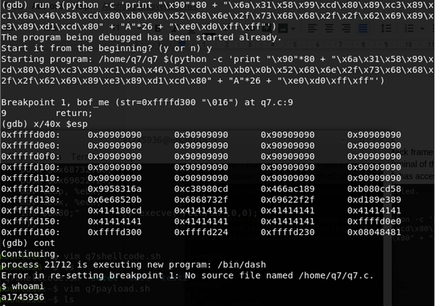
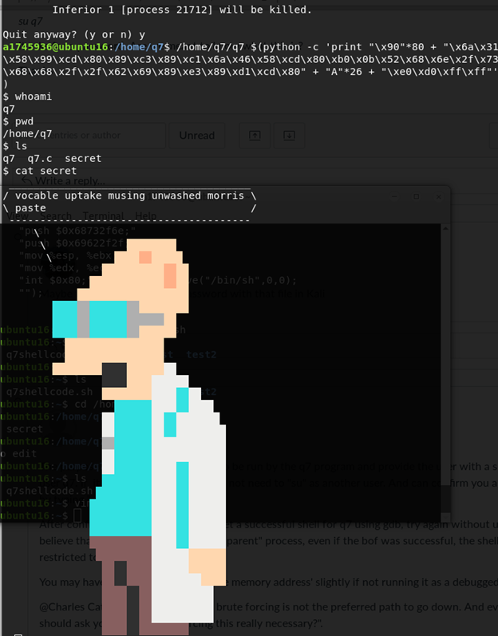
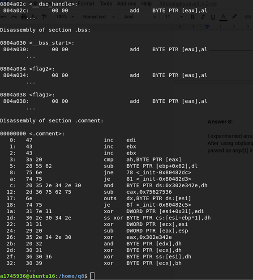
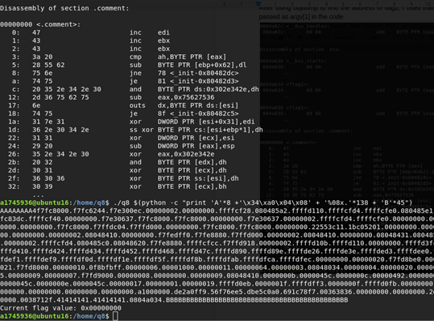

### Answer 1
After reading and understanding most of the q1.c code I realized I need to change the local variable changeme by eating into the program’s main’s frame up about 1024 bytes with the format string exploit, using the technique from the workshop. After trying to write more and more areas by changing 4-byte values up the frame, the following one worked -
```
# ./q1 $(python -c 'print "A" + "%08x."*220')
```
### Answer 2
Followed same technique as Q1. Wrote 1024 A characters and then set changeme to the value needed based on the code in q2.c file
The command that I ran was -
# ./q2 $(python -c 'print "A"*1024 + "\xad\xdd\xba"')

### Answer 3
Following on from Q2, I first checked the address of the secret_func() function using objdump and then injected that address after the 1024 char array into the same way as Q2
The commands I used were -
```
# objdump -D -M intel q3 | grep -A70 secret_func
# ./q3 $(python -c 'print "A"*1024 + "\x8b\x85\x04\x08"')
```
### Answer 4
I researched a lot about how to provide modifiers to sprintf to give out a different format for integers and strings till I finally found this reference - 
http://docs.roxen.com/pike/7.0/tutorial/strings/sprintf.xml

Then I used the %Nd modifier which means  	- An integer right-justified in a field at least N characters wide
Then I found the memory address of the secret_func with objdump similar from the previous question Q3 and then set the integer as the memory address in the above sprintf modifier with the following command -
```
# ./q4 $(python -c 'print "%1024d\xbb\x85\x04\x08"')
```

### Answer 5
Since I could not modify the binary, move it or recompile it with new code, I went to my own user folder on the machine where I had privileges. After a lot of trying and seeing the vague hints on discussion forum what I could understand is that I have to run the binary as it is without modifying it and I need to check the color guides for files in the terminal.

When I found out about symbolic links also having their own color, I tried to create a symbolic link with my own local binary and a link named ‘secet’ to point to the original secret file. This way I could run the SETUID binary to run cat command my link ‘secet’ which pointed to the original secret file.

### Answer 6
After inspecting the code in q6.c, I saw that the value of the environment variable ‘Q6_SECRET_CODE’ is stored in the locals.buffer and we need to overflow that to change the value of the locals.flag to 0xdeadbeef. So first I experimented by setting this environment variable in my own user a1745936 and using the ‘set’ command to see if it works or not and what is the value of the ‘Q6_SECRET_CODE’. Then I went back to the /home/q6 folder and tried the same and it worked the same way. Then I executed the program q6 after setting the ‘Q6_SECRET_CODE’ environment variable and found the secret. The bash commands I used before execution were -
```
# export Q6_SECRET_CODE="$(python -c 'print "A"*1024 + "\xef\xbe\xad\xde"')"
# set | grep "Q6_SECRET_CODE"
``` 

### Answer 7
I followed all the steps of the workshop for checking stack frame and injecting shell code. Once it worked in gdb , I changed the path and ran it in the terminal of the machine and then opened the secret file because I got shell through q7 program which has access to the secret file. 

Given below is first screenshot of gdb running the shell code as user a1745936 and then terminal running shell code as q7 and displaying the secret. 



### Answer 8

I experimented around and tried to understand what is to be done, similar to the provided video.
After using objdump to find the address of flag2, I used that address to create the payload to be passed as argv[1] in the code


  
```
# ./q8 $(python -c "print 'A'*8 +'\x34\xa0\x04\x08' + '%08x.'*138 + 'B'*45")
```
